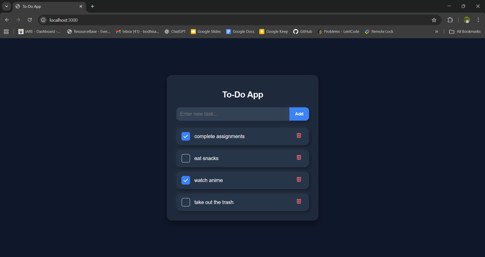

# ✅ TODO WebApp

A full-stack **To-Do Web Application** built using **Node.js, Express, MongoDB, and Vanilla JavaScript**.  
This app allows you to **add, edit, delete, and mark tasks as completed**, with full backend persistence.

---

## 🚀 Features

- ➕ Add new tasks  
- ✏️ Inline edit tasks (click to edit and save)  
- ✅ Mark tasks as completed (toggle checkbox)  
- ❌ Delete tasks  
- 🔄 Auto-sync with backend (GET, POST, PATCH, DELETE)  
- ⌨️ Press **Enter** to add tasks quickly  

---

## 📂 Project Structure

```

📦 TODO-WEBAPP
┣ 📂 models
┃ ┗ 📜 Todo.js            # Mongoose schema/model
┣ 📂 public
┃ ┣ 📜 index.html         # Frontend UI
┃ ┣ 📜 script.js          # Frontend JS logic
┃ ┗ 📜 style.css          # Styling
┣ 📜 .env                 # Environment variables
┣ 📜 .gitignore
┣ 📜 main.js              # Express backend entry point
┣ 📜 package.json
┣ 📜 package-lock.json
┗ 📜 README.md

````

---

## ⚙️ Setup & Usage

### 1. Clone the repository
```bash
git clone https://github.com/Bodhisattva-Duduka/Todo-Webapp.git
cd <Todo-Webapp>
````

### 2. Install dependencies

```bash
npm install
```

### 3. Create `.env` file

```env
PORT=5000
MONGO_URI=your_mongodb_connection_string
```

### 4. Start the backend server

```bash
node main.js
```

Server runs on:

```
http://localhost:5000
```


### Example Task Object

```json
{
  "id": "1756835809958",
  "title": "Eat snacks",
  "completed": false
}
```

---

## 🛠️ Tech Stack

* **Frontend:** HTML, CSS, JavaScript (Vanilla JS)
* **Backend:** Node.js, Express.js
* **Database:** MongoDB + Mongoose

---


## 📸 Demo

*(Add screenshots or GIFs of your app here once ready)*


---